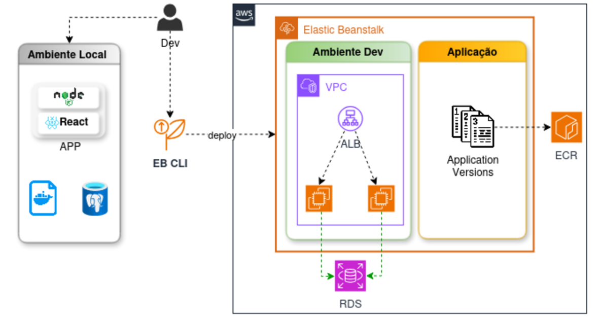
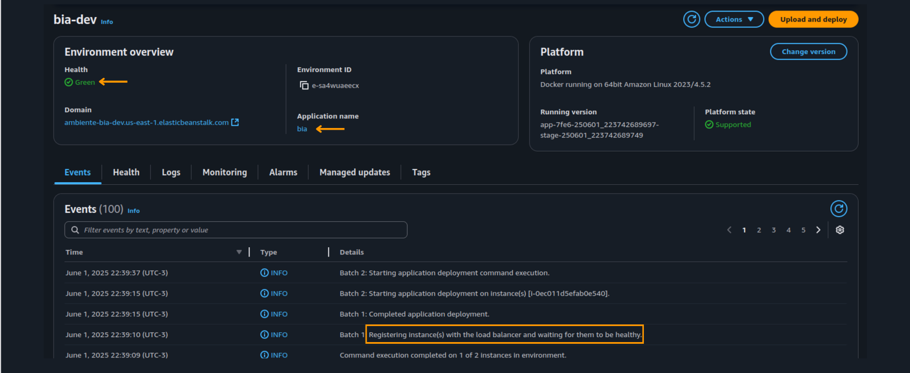
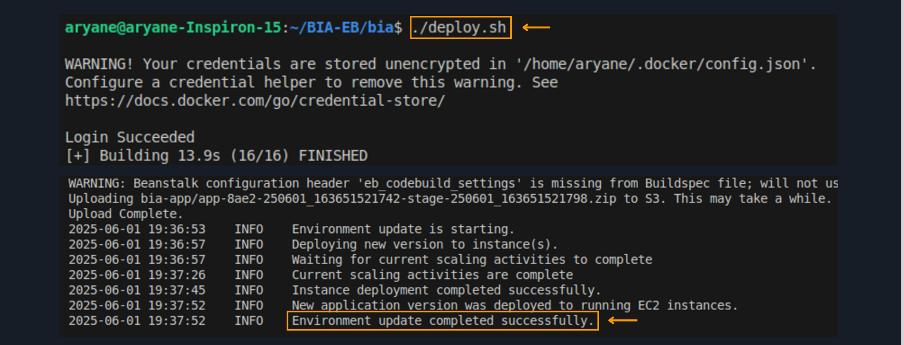
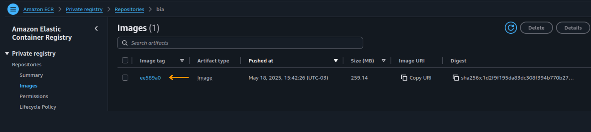
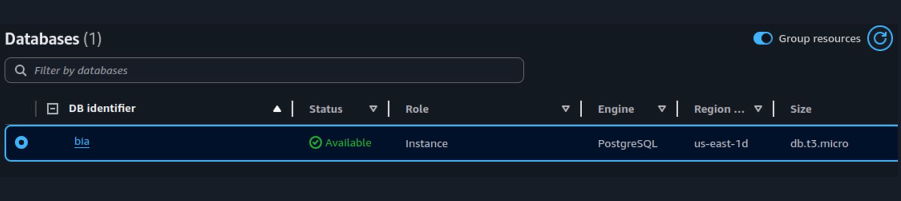
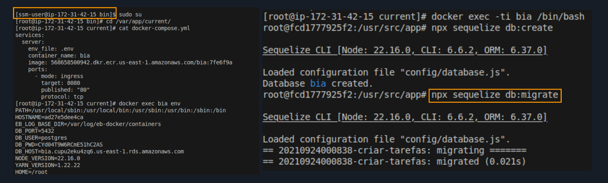

# 🚀 Projeto Elastic Beanstalk com Docker + EB CLI

Este repositório documenta todas as etapas práticas do desafio de aplicações gerenciadas com **Elastic Beanstalk**, **Docker** e **EB CLI**, desenvolvido durante a **Mentoria Desafio Labs 2.0** da Formação AWS com **Henrylle Maia**.

---

## 🧠 Objetivo

Desenvolver uma aplicação containerizada com **deploy automatizado via EB CLI**, utilizando **Elastic Beanstalk** com foco em ambientes desacoplados, monitoramento, troubleshooting, integração com o **RDS**, e aplicação de boas práticas de infraestrutura como código e versionamento.

---

## 📊 Arquitetura da Solução

- Aplicação containerizada com **Docker**
- Gerenciamento de ambientes com **EB CLI**
- Deploy baseado em **branches** e ambientes separados (ex: dev)
- Balanceamento de carga via **Elastic Load Balancer**
- Banco de dados provisionado no **Amazon RDS**
- Conexão e inspeção de instâncias com **SSM via CloudShell**
- Monitoramento e logs com **AWS CloudWatch**
- Customização com `config.yml` e `docker-compose`

---

## 📌 Etapas Relevantes do Projeto com EB CLI

- Configuração inicial do projeto para uso com **EB CLI**
- Ajuste de permissões IAM para execução via terminal
- Criação de ambientes separados com suporte a **Load Balancer**
- Deploys realizados diretamente da **EC2 via EB CLI**
- Criação de `config.yml` para ambientes baseados em branch
- Configuração de variáveis de ambiente sensíveis no Beanstalk
- Uso de **SSM** para troubleshooting dentro das instâncias EC2
- Uso de `sed`, `--no-normalize`, `container_name`, argumentos e múltiplos `docker-compose`
- Deploys resilientes com rollback e inspeção de logs para correção de erros

---

## 🛠️ Tecnologias e Serviços Utilizados

| Categoria       | Tecnologias                                                                  |
|----------------|-------------------------------------------------------------------------------|
| Containers      | Docker, Docker Compose, Amazon ECR                                           |
| Deploy & Gestão | Elastic Beanstalk, **EB CLI**, Load Balancer                                 |
| Banco de Dados  | Amazon RDS                                                                   |
| Monitoramento   | AWS CloudWatch                                                               |
| Automação       | Shell Script, AWS CloudShell, SSM                                            |
| Segurança       | IAM, Configuração de variáveis de ambiente, Security Groups                  |

---

## ✅ Resultados Obtidos

- Deploy automatizado e versionado via EB CLI com ambientes dedicados
- Infraestrutura desacoplada com comunicação entre containers e RDS
- Troubleshooting direto via SSM e análise de logs no CloudWatch
- Personalização da stack Docker com foco em ambientes escaláveis e seguros
- Prática aprofundada de gerenciamento de aplicações com Elastic Beanstalk

---

## 📷 Capturas de Tela

###  Arquitetura

---

### Aplicação via EB CLI com persistencia de dados 

---

### Ambiente Elastic Beanstalk com Load Balancer

---

### Deploy

---

### Imagem Docker enviada para o ECR via AWS CLI

---

### Banco de Dados PostgreSQL no RDS 

---

### Execução de Database Migration via AWS Systems Manager (SSM) 

---

## 📄 Licença

Projeto educacional sem fins comerciais.

---

## 💬 Contato

Vamos conversar sobre EB CLI, Docker e automação na AWS:

- LinkedIn: [www.linkedin.com/in/aryane-andrade](https://www.linkedin.com/in/aryane-andrade)  
- Email: aryaneands@gmail.com  

---

> 🔥 Desenvolvido por Aryane, durante a Mentoria AWS com Henrylle Maia, com foco prático em **Elastic Beanstalk**, **Docker** e **EB CLI**.
